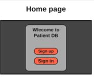
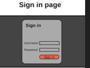
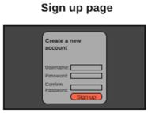
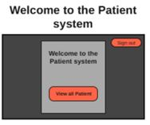

# patient-system

## Project describtion:

* Our project is an patient system where we as users(employees) have an account to sign-in with, also we have to recive a patient where we register them and based on the level of 
case and the department he want to go for , then we can view the details of the patient which we can edit and delete.

## user stories:

* -as a user i want to have a uniqe username where no one can have a username as my username.

* -as a user i want to view all the patients in the index page.

* -as a user i want to view the details of the patients and so i can edit them and update them easiley.

* -as a user i want to delete a patient account easily.

* -as a user when i want to move smothely between pages so my navigation between pages be easy.

* -as a user i want to sign out so no one can use my account.

## ERD:
(picture)

## wireframes (prototype)

### Home page

 

### sign-up page

 

### sign-in page

 

### index page (welcome)

 

### view all patients page

 

### add pateint page

 

### patient details page

 

### edit patient details

 