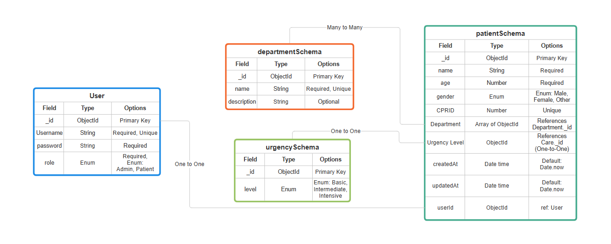
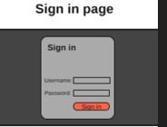
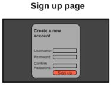
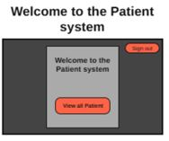
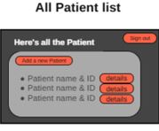
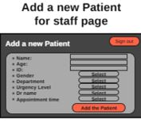
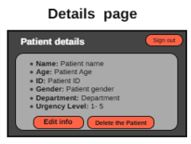
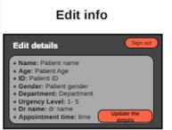

# Patient System

### Names:

*Hussain almajed*

*Abdullah khalid*

*Abdulrahman Alaam*

## Project Description
Our project is a patient management system where employees can:
- Sign in using unique accounts.
- Register patients based on their case level and desired department.
- View, edit, and delete patient details.

This system ensures smooth navigation and role-based access for administrators and patients.

## User Stories
- As a user, I want to have a unique username so no one else can use my username.
- As a user, I want to view all patients on the index page.
- As a user, I want to view patient details, making it easy to edit and update information.
- As a user, I want to delete patient accounts with ease.
- As a user, I want smooth navigation between pages.
- As a user, I want to sign out so no one can misuse my account.

## ERD

## Wireframes (Prototype)

### Home Page

### Sign-Up Page

### Sign-In Page

### Index Page (Welcome)

### View All Patients Page

### Add Patient Page

### Patient Details Page

### Edit Patient Details

### Our trello:

**https://trello.com/invite/b/67515ac4d7b3ab49767cbec8/ATTI714007e59be3ba0e2c62ec806b96848454AFC1FB/project-2**

## Future Enhancment:

* To add more admins.

* Adding a search bar.

* Adding a Booking for the appointments with DR's and adding slot which each DR can add his available timing or slot so his patients can book an appointment.